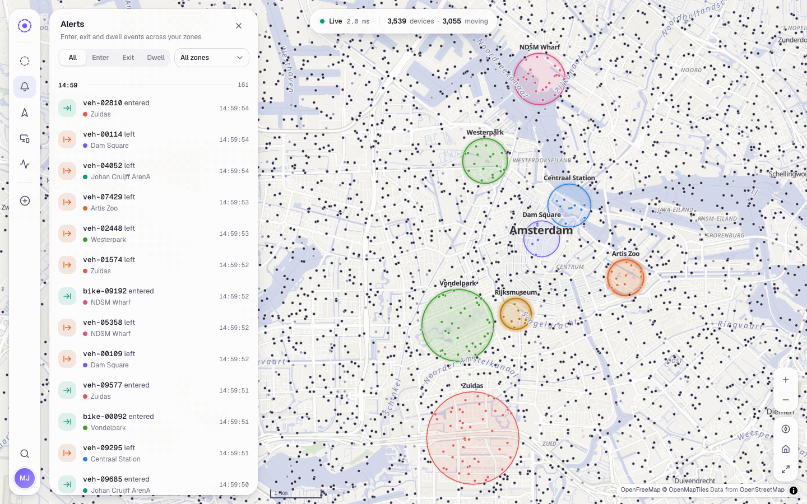
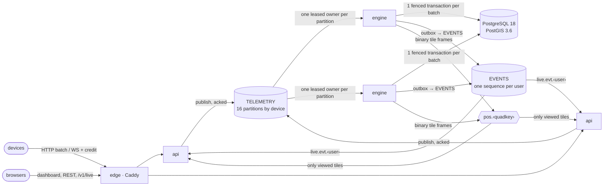

# Perimeter

Live tracking and geofence alerts for large device fleets, built on FastAPI, PostGIS and NATS
JetStream.

Devices report their positions over HTTP or a WebSocket. Every browser session watches the fleet
move in real time and is alerted the moment a device enters, leaves or lingers in one of that
user's circular geofences — on every tab and device the user has open, with nothing lost when a
connection drops, a replica restarts or a process is killed.



**[Run it](#run-it) · [Load generator](#load-generator) · [How it works](#how-it-works) ·
[Design decisions](#design-decisions) · [Measured](#measured) · [API](#api) · [Tests](#tests) ·
[Limits and next steps](#limits-and-next-steps)**

## Run it

You need Docker Engine 26 or newer (secrets are mounted from volume subpaths) and Docker Compose
v2; the stack was verified with Engine 28.4 and Compose 5.0. Everything else — Python, Node,
PostgreSQL, NATS — builds inside the stack. Allow about 3 GB of memory.

```bash
make up                  # docker compose up -d --build --wait
open http://localhost:8080
```

Sign in with any name (the brief allows mocked authentication). Open the dashboard in a second
browser with the same name — or on your phone, see `HTTP_BIND` in `.env.example` — and every
session receives every alert and every zone change as it happens.

| | |
|---|---|
| Dashboard | <http://localhost:8080> |
| Interactive API reference | <http://localhost:8080/docs> |
| Drive 10,000 devices | `make load` |
| Check the whole path in 2 s | `make smoke` |
| Kill a replica under load and audit the result | `make drill` (`KILL=api` for an API replica) |
| Traces and metrics | `make observe` → Jaeger on :16686, Prometheus on :9090 |
| Stop / delete everything | `make down` / `make destroy` |

`make help` lists every target; each is one line of `docker compose` or `uv` in the `Makefile`, so
nothing requires make. There is nothing to configure: the first start generates every credential
into a Docker volume (see [Security](#9-secure-by-default)). `.env.example` documents the
optional knobs.

## Load generator

`generator.py` is the simulator the brief asks for: an asyncio script that moves 10,000 devices
at once and reports each position every few seconds.

```bash
make load                                   # 10,000 devices through the edge, inside the network
make ingest-token                           # or from the host: copy the device token once, then
uv run generator.py --token-file .secrets/ingest_token --observe demo --zones 20
```

- **Realistic movement.** Random-waypoint trips with turn-rate-limited curves and pauses;
  vehicles, cyclists and pedestrians at their own speeds; 5 % of devices never move; Gaussian GPS
  noise; longitude steps scaled by latitude. `--seed` replays a run exactly.
- **Open loop.** Every device reports on its own schedule whatever the server does, so an
  overloaded server shows up as throttling and dropped reports instead of a politely lowered load.
  One clock task and a heap schedule the fleet — no task per device.
- **Two transports.** HTTP batches over keep-alive connections, or WebSockets with credit-based
  flow control (`--transport ws`). `503`/`429` `Retry-After` pause only the connection that got
  them.
- **Observe mode.** `--observe NAME` signs in, creates demo zones (`--zones`), opens the live
  channel and measures device-to-browser latency of positions and alerts.
- **Books that balance.** Every report ends accepted, rejected (by code) or dropped (by reason);
  the summary says so, and `--json` writes it to a file.

## How it works



**The life of one location report**

1. A device posts a batch to the **edge** (Caddy), which balances over the API replicas.
2. An **API replica** checks the device token and admission control *before reading the body*,
   decodes and validates every report in C (msgspec), and publishes each one to JetStream with a
   de-duplication id. It answers `202` only after JetStream has stored all of them: an
   acknowledged report is durable.
3. The **TELEMETRY** stream partitions reports by device (`partition(16)` subject mapping in the
   broker), so one device's reports always land in the same partition, in order.
4. The **engine** replica that holds the partition's lease fetches a batch and applies it in one
   transaction: claim the partition with its fencing token, ask PostGIS which active zones contain
   each report (one indexed statement for the whole batch), run the enter/exit/dwell state machine,
   write positions, the device tracks, presence, alerts and their outbox events. Commit, then
   acknowledge.
5. Alert events leave the outbox for the **EVENTS** stream, where each user has a gap-free
   sequence; the broker republishes them to `live.evt.<user>`. Positions go out as binary frames
   on `pos.<quadkey>` subjects, one per map tile.
6. Every API replica serving a session of that user relays the event bytes to each socket; every
   replica with a viewer on that tile relays the position frame. The browser draws both.

| Component | Role |
|---|---|
| `edge` | Caddy: serves the dashboard, proxies REST and WebSockets to the API replicas (DNS discovery), strict security headers. The only published port. |
| `api` ×2 | FastAPI + uvicorn: REST, device ingestion (HTTP and WebSocket), the live channel. Stateless apart from its open sockets. |
| `engine` ×2 | The geofence processor: partition ownership, batch transactions, outbox relay, tile frames. |
| `nats` | JetStream: `TELEMETRY` (device reports, partitioned), `EVENTS` (per-user durable events), KV buckets for leases, live sessions and revoked tokens. |
| `db` | PostgreSQL 18 with PostGIS 3.6: users, zones, latest positions, device tracks (time-partitioned), presence, alerts, outbox. |
| `secrets`, `init` | One-shot jobs: generate credentials on first start; run migrations and provision the broker. |

## Design decisions

The brief grades high-load architecture, spatial database use, WebSocket architecture, async
correctness, code quality and the Docker setup. Each decision below names what it answers and the
evidence behind it.

### 1. Spatial queries: `geography` for truth, a planar envelope for speed

Zone centres and device positions are `geography(Point, 4326)`: distances in metres on the WGS84
spheroid, anywhere on Earth, with no projection to choose. The containment test is always
PostGIS's own `ST_DWithin(zone.center, point, zone.radius_m)`; nothing measures distance in
Python.

Written that way on its own, the test cannot use an index, because every zone has its own radius
and the search distance comes from the indexed table. Each zone therefore also stores an
**envelope**: a lon/lat box computed by a SQL function in a generated column and indexed with
GiST. The engine's batch statement filters by the box first and decides with the exact predicate:

```sql
JOIN geozones z
  ON z.is_active
 AND z.envelope && ST_SetSRID(ST_MakePoint(r.lon, r.lat), 4326)          -- GiST, planar, cheap
 AND ST_DWithin(z.center, ST_SetSRID(ST_MakePoint(r.lon, r.lat), 4326)::geography, z.radius_m)
```

The box is provably large enough, not padded by a guess. A meridian degree is shortest at the
equator (`a(1−e²)·π/180 ≈ 110 574 m`), which bounds the latitude span; every point of a geodesic
of length `r` stays inside that latitude band, where a parallel's radius is at least `a·cos φ*`,
which bounds the longitude span. Near a pole the box spans all longitudes; across the antimeridian
it is two boxes.

| 1,000 reports against | naive `ST_DWithin` join | envelope + `ST_DWithin` |
|---|---|---|
| 100 zones | 108 ms | 4.2 ms |
| 1,000 zones | 724 ms | 14.3 ms |
| 10,000 zones | 7,097 ms (sequential scans) | 80 ms (index scans), identical results |

Tests keep it honest: the SQL function and its Python mirror agree to 1e-9°; Hypothesis places
points just inside and just outside random circles — including polar and antimeridian ones — with
GeographicLib (Karney's geodesics, independent of PostGIS) and checks PostGIS decides every one
correctly; the batch query is compared with the naive join on 400 zones × 1,000 points; and
`EXPLAIN` must show an index scan on the envelope index.

The questions asked from the devices' side use their own indexes. "Which devices are in this
viewport" is a lon/lat rectangle, so it runs as a planar test on an index over
`position::geometry` (a `geography` box would have great-circle edges that bow towards the pole
and miss points near its equatorward edge — a property test caught exactly that). A device's
trail reads its track: every applied report, kept in 10-minute range partitions that the engine
rolls forward and drops whole (a `SECURITY DEFINER` function, so the services need no DDL rights).

### 2. Ingestion: acknowledged means stored, overload means "come back in N seconds"

- `POST /v1/telemetry` accepts one report, an array or `{"reports": [...]}` in the brief's field
  names (`device_id`, `latitude`, `longitude`, `timestamp`), validates each report on its own and
  answers `202 {"accepted": n, "rejected": [{index, code, detail}]}` **after** JetStream has
  stored every accepted report.
- **Admission control** watches the only number that matters, the engine consumers' backlog.
  Above `INGEST_ADMISSION_HIGH` reports it sheds: `503` with a `Retry-After` computed from the
  measured drain rate, answered before the body is read; it resumes below
  `INGEST_ADMISSION_LOW` (hysteresis). If the backlog cannot be measured it fails closed.
- An **in-flight budget** (`INGEST_MAX_INFLIGHT`, weighted, first-come-first-served) bounds the
  reports a replica holds while waiting for acknowledgements: `429` rather than unbounded memory.
- **WebSocket ingestion** (`/v1/telemetry/stream`) uses credit: the server grants a window of
  reports, returns credit as frames are stored, and while shedding simply withholds it. A device
  pauses instead of dropping or being disconnected.
- A device that retries a report is stored once (`Nats-Msg-Id = device:timestamp`); reports older
  than the device's last one are kept for its trail but never change its state.

### 3. One owner per partition — and a fence for the owner who has not noticed it lost

Reports of one device must be applied in order, so exactly one engine consumes each partition:

- **Assignment** by rendezvous hashing over the live engines (heartbeats in a KV bucket): every
  engine computes the same answer, and a joining or leaving engine moves only its own share.
- **Leases** in a KV bucket, created with compare-and-set and renewed by revision. A crashed
  engine's leases expire after `ENGINE_LEASE_TTL_S`; a stopping engine hands them back at once.
- **Fencing.** A paused engine can wake up after its lease expired. Each lease yields a token —
  (bucket generation, revision), strictly increasing — and every batch transaction starts by
  claiming the partition with it: `UPDATE partition_epochs … WHERE (generation, revision) <= …`.
  A stale owner's transaction matches no row and rolls back; nothing it read gets written.
- **Takeover recovery.** Messages the dead owner had fetched but not acknowledged come back from
  the broker only after the ack timeout — after the new owner has applied newer reports of the
  same devices, which would make them late and lose their transitions. The new owner therefore
  first reads that unacknowledged range straight from the stream and applies it, then fetches.
  This was found by killing an engine under load (222 of 2,700 alerts missing), fixed, and is
  pinned by a test that fails without the fix.
- **Batching** grows with load: a drained partition lingers `ENGINE_LINGER_MS` before its next
  fetch so one transaction carries many reports; under a backlog every batch is full.

### 4. Alerts: exactly the transitions, in order

The engine asks PostGIS which zones contain each report; a pure, separately tested state machine
turns that into transitions per device and zone:

- **enter** when a device reports from inside a zone it was not in (including the first report
  after a zone is created around it), **exit** when it reports from outside a zone it was in,
  **dwell** once per stay after `dwell_s` seconds inside;
- reports are applied in event-time order, so a device that crosses a zone between two batches
  still yields both `enter` and `exit`; a report not newer than the device's last one changes
  nothing (redelivery is harmless);
- deactivating a zone clears its presence silently; editing its geometry keeps presence and lets
  the next report decide.

The brief also asks to notify "whenever a device reports a location within" a zone. A parked
device would then page its owner every few seconds, so every in-zone report is still pushed — as a
live **pulse** on the zone — while durable alerts are reserved for transitions.

Hypothesis checks the invariants over random tracks: splitting a track into batches in any way
yields the same alerts; enter and exit alternate per zone; replaying applied reports is a no-op;
dwell fires at most once per stay.

### 5. WebSocket fan-out: encode once, filter at the broker, never wait on a socket

- **Positions are binary.** A tile frame holds ids and fixed-point columns (26 bytes per device
  against 113 as JSON). The engine encodes it once; API replicas forward the bytes to every
  interested socket without decoding them. Browsers read the columns straight into WebGL buffers.
- **The broker does the filtering.** Frames are published per map tile on
  `pos.<d1>.<d2>…<d12>` — one quadkey digit per subject token. A replica subscribes to the
  smallest set of prefixes covering its clients' viewports (`pos.1.2.0.>` for a wide view,
  twelve digits for a street), so a replica receives only what someone it serves is looking at.
  Every frame reaches each interested socket once, which Hypothesis checks against the trie.
- **Producers never await a socket.** Each connection has a reader task, a writer task and two
  bounded lanes: events (by count) and positions (by bytes). A client that falls behind on
  positions has them dropped and gets a `resync` (positions are state, the next snapshot is
  newer); one that falls behind on events is closed with 4008 and resumes by sequence. Every send
  has a timeout. A stalled client costs its own lanes, nobody else's latency (tested).
- **Snapshots** of a newly viewed area come from PostGIS, are cached per tile for a second and
  are shared by concurrent requests, so a room full of reconnecting dashboards runs one query.

### 6. Many sessions per user, on any replica, with nothing missed

- Alerts and zone changes are **durable events**: written to a transactional outbox in the same
  transaction as the change, relayed to the `EVENTS` stream (fast path right after commit, plus a
  sweeper for crashes in between), de-duplicated by id. Each user has one subject, so the stream
  gives each user a gap-free sequence.
- The broker **republishes** each event to `live.evt.<user>` with its sequence and the previous
  sequence of the same user. A replica subscribes once per user it serves and relays the event to
  all of that user's sockets. If the previous sequence is not the last one it saw, it heals the
  gap from the stream before delivering.
- **Resume.** A browser remembers the last sequence it received; after a reconnect — to any
  replica — it sends `resume_after`, gets exactly the events it missed, then continues live.
- A cluster-wide **session registry** (KV bucket) lists a user's live sessions on every replica;
  signing one out remotely revokes its token everywhere and closes its socket with 4001.

### 7. Connection pools that fail fast instead of piling up

Pools are bounded with no overflow and a short checkout timeout (`DATABASE_POOL_TIMEOUT_S`): pool
exhaustion becomes an immediate `503 database_unavailable` with `Retry-After`, never a queue of
coroutines holding requests open. Statement and idle-in-transaction timeouts on the server back
that up. No database connection is held across a WebSocket's lifetime or across broker I/O. The
budget is explicit: 2 API × 10 + 2 engines × 18 (a connection per partition it may own, plus two)
+ init = 58 of `max_connections=80`. Snapshot queries may use at most a quarter of the API pool.

### 8. The event loop stays free

Validation and serialisation run in C (msgspec, pydantic-core), distance maths in PostGIS, binary
frames are packed with `array`/`struct`, and every queue, wait and send is bounded. Each process
measures its own event-loop lag and exports it (`perimeter_event_loop_lag_seconds`, plus the
dashboard's Pipeline view), so "nothing blocks the loop" is a number, not a claim.

### 9. Secure by default

- **No secrets in the environment, compose file or git.** A one-shot job generates every
  credential into a volume on first start; each service mounts only its own directory and reads
  `*_FILE` settings. PostgreSQL gets SCRAM verifiers, NATS gets bcrypt hashes.
- **Least privilege.** Separate database roles (schema owner for migrations, a row-only role for
  the services). Per-service broker users with subject allow-lists: the API cannot delete or
  consume streams, nobody can purge them (`make audit-broker` checks the broker log).
- **Containers** run as non-root users with read-only root filesystems, no capabilities,
  `no-new-privileges`, resource limits and an `internal` network for the database and broker:
  only the edge publishes a port, on 127.0.0.1 by default.
- **HTTP**: strict Content-Security-Policy, `nosniff`, `frame-ancestors 'none'`,
  `Referrer-Policy`, `Permissions-Policy`; tokens in URLs are redacted from logs.
- **Sessions**: signed, expiring tokens in an HttpOnly, SameSite cookie; a WebSocket authenticated
  by that cookie must come from an allowed `Origin` (cross-site WebSocket hijacking); sign-in is
  rate-limited; another user's zone answers `404`, never `403`.

## Measured

Measured on a laptop (Apple M5 Pro; Docker in an 8-vCPU VM) with the stack exactly as shipped,
load going through the edge like real devices. Methods, commands and the full tables:
[docs/benchmarks.md](docs/benchmarks.md).

| Scenario | Result |
|---|---|
| **10,000 devices, a report every 3 s** (the brief), 5 min | 980,397 of 980,397 reports accepted; `202` p99 **13 ms**; position device → browser p50 128 ms, p99 202 ms; alert p50 79 ms, p99 133 ms; event-loop lag p99 5 ms; engines at 26 % of a core each |
| 10,000 devices, a report every second | 9,400 reports/s, nothing lost; `202` p99 19 ms; position p99 183 ms; alert p99 123 ms |
| 30,000 devices, a report every second | **27,700 reports/s sustained** without shedding (PostgreSQL is the limit) |
| 60,000 devices, a report every second (2× the ceiling) | admission control sheds with `503` + `Retry-After`; backlog bounded at 132k, back to 0 within 8 s; 0 accepted reports lost |
| 10,000 devices over 32 WebSockets (credit) | 380,129 accepted, 0 errors; ack p50 5.7 ms |
| **200 dashboards** watching the whole fleet | 665,000 positions/s delivered (every viewer gets all 3,300/s); p50 150 ms; server send p99 0.1 ms, 0 frames dropped |
| **Engine killed** (SIGKILL) under load | 0 reports lost, 0 duplicate or missing alerts, observer got 1,212 / 1,212; orphaned partitions owned again after 7.8 s |
| **API replica killed** under load | 0 lost; the observer's socket was on it, resumed on the other replica and got 1,249 / 1,249 alerts |

Running it, rather than reading it, is what found the hardest bugs:

- **Killing an engine under load lost 222 of 2,700 alerts.** Messages a dead owner had fetched
  came back only after the ack timeout, behind newer reports, and were discarded as late. The new
  owner now replays that unacknowledged range first; the drill loses nothing, and a test that
  fails without the fix pins it.
- **Alerts took 5–10 s instead of 80 ms.** A broker permission refused the API's per-user
  subscription; the self-healing audit hid the failure by delivering every event within its
  10-second cycle. `make audit-broker` now fails on any refusal, and the permission test
  subscribes exactly the way the API does.
- **Trail reads could take the broker down.** Reading one device's history out of the telemetry
  stream made the broker walk every file block; under load it hit its memory limit. Tracks moved
  to time-partitioned PostGIS tables; the broker went from ~780 MB to ~150–300 MB under the same
  load.
- **Viewport queries missed devices** near the equatorward edge of wide boxes (Hypothesis found
  it): a `geography` rectangle has great-circle edges. Viewports are now planar lon/lat queries.

## API

Full schemas: <http://localhost:8080/docs>. Errors are RFC 9457 problem details
(`application/problem+json`) with a stable `code`.

| Method | Path | |
|---|---|---|
| `POST` | `/v1/session` | Sign in with a username (created on first use); sets the session cookie, returns a bearer token |
| `DELETE` | `/v1/session` | Sign out (the token is revoked on every replica) |
| `GET` | `/v1/me` | The signed-in user |
| `GET` `POST` | `/v1/geozones` | Your zones (keyset pages, with live occupancy) · create a zone |
| `GET` `PATCH` `DELETE` | `/v1/geozones/{id}` | One zone; `ETag`/`If-Match` for safe concurrent edits |
| `GET` | `/v1/geozones/{id}/occupants` | Devices inside the zone now |
| `GET` | `/v1/alerts` | Alert history: filter by zone, kind, device, time; keyset pages |
| `GET` | `/v1/devices?bbox=w,s,e,n` | Latest positions in a viewport (GeoJSON) |
| `GET` | `/v1/devices/{id}` · `/trail` | Latest state and your zones it is in · recent track (kept 30 minutes) |
| `GET` `DELETE` | `/v1/sessions` · `/{sid}` | Live sessions of this user on every replica · remote sign-out |
| `POST` | `/v1/telemetry` | Device ingest (device token) |
| `WS` | `/v1/telemetry/stream` | Device ingest with credit flow control |
| `WS` | `/v1/live` | The dashboard's live channel |

```bash
curl -s -c jar -X POST localhost:8080/v1/session -H 'content-type: application/json' \
     -d '{"username": "ada"}'
curl -s -b jar -X POST localhost:8080/v1/geozones -H 'content-type: application/json' \
     -d '{"name": "Dam Square", "center": {"lat": 52.3731, "lon": 4.8926}, "radius_m": 250}'
make ingest-token
curl -s -X POST localhost:8080/v1/telemetry -H "authorization: Bearer $(cat .secrets/ingest_token)" \
     -H 'content-type: application/json' \
     -d '{"device_id": "truck-7", "latitude": 52.3733, "longitude": 4.8921, "timestamp": "2026-09-27T12:00:00Z"}'
```

**Live channel.** Server to client: `hello` first (session, resume mode, tile zoom), then binary
position bundles, `event` frames `{seq, prev, event}` (alerts and zone changes), `pulse`,
`sessions`, `resync`, `ops`, `pong`. Client to server: `viewport` (bounding box and zoom),
`resume` (or `?resume_after=` on connect), `ping`, `ops`. Close codes: 4001 signed out, 4003
forbidden, 4008 fell behind (resume), 4009 too many sessions, 1001/1011/1012/1013 reconnect.

## Tests

```bash
make test          # everything; integration tests start PostGIS and NATS in containers
make test-unit     # no Docker needed
make lint typecheck
cd web && npm test
```

764 Python tests (480 unit, 284 integration) with 94 % line and branch coverage, and 471 web
tests; `mypy --strict` and Ruff are clean. Integration tests run against real PostgreSQL + PostGIS
and NATS started by testcontainers (or services named by `TEST_DATABASE_URL` / `TEST_NATS_URL`).
Highlights:

- **Spatial correctness**: Hypothesis against GeographicLib at every latitude and across the
  antimeridian; indexed matching equal to the naive join; `EXPLAIN` asserts the index plans.
- **The state machine**: any split of a track into batches gives the same alerts; replays are
  no-ops; enter/exit alternate; dwell once per stay.
- **Failure paths on real infrastructure**: fencing rejects a stale owner; two engines split and
  hand over partitions; a crashed owner's unacknowledged messages are replayed first; zones
  deleted mid-batch; pool exhaustion and statement timeouts answer `503`.
- **The live channel with two real API servers** sharing one broker: one user's sessions on both
  receive each event once; resume after a disconnect replays exactly the gap; gap healing; slow
  consumers; remote sign-out; origin rules; session caps.
- **The broker's permission matrix** on a secured server: each service's real work passes, each
  forbidden action is refused.

CI (`.github/workflows/ci.yml`) runs lint, types and the full suite with a coverage floor, the
web gates, and a stack job that builds the images, starts the stack and runs `make smoke` and
`make audit-broker`.

## Limits and next steps

- **One PostgreSQL, one NATS server.** Streams and buckets run with one replica; a crashed
  broker or database stops the pipeline until it restarts (durable state survives restarts). A
  three-node NATS cluster (R3 streams) and a PostgreSQL replica change configuration, not code.
- **PostgreSQL is the throughput limit** (~28,000 reports/s here, with tracks). Next steps would
  be `COPY` for the track inserts and a separate store for position history (TimescaleDB or a
  columnar store), keeping the transactional state small.
- **Positions are fleet-wide**, as in the brief: every user sees every device, while zones and
  alerts are per user. Tenant-scoped fleets would add a tenant token to the position subjects.
- **Failover pause**: a crashed engine's partitions wait for its leases to expire (6 s) plus one
  round; a shorter `ENGINE_LEASE_TTL_S` trades broker writes for faster takeover.
- **Alerts are report-driven**: a device that goes silent inside a zone stays inside it until it
  reports again; a staleness timeout could close such stays.
- **Mocked sign-in** (a username, no password), as the brief allows; the rest of the system only
  sees the signed token's claims, so an OIDC provider replaces one module.
- **Plain HTTP on localhost.** Caddy can terminate TLS by itself for a real hostname; set
  `SECURE_COOKIES=true` behind TLS.
