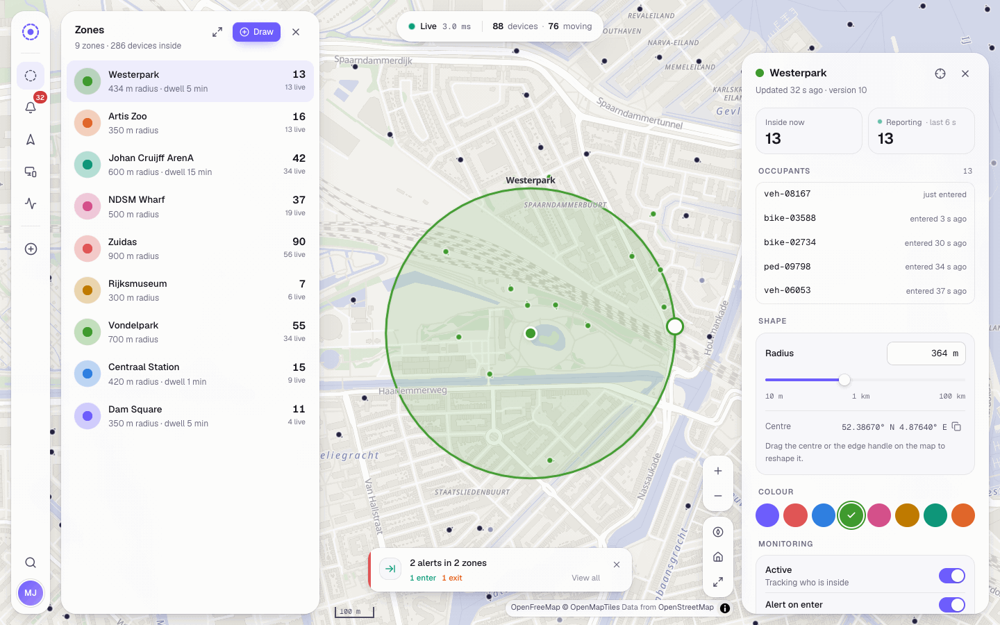
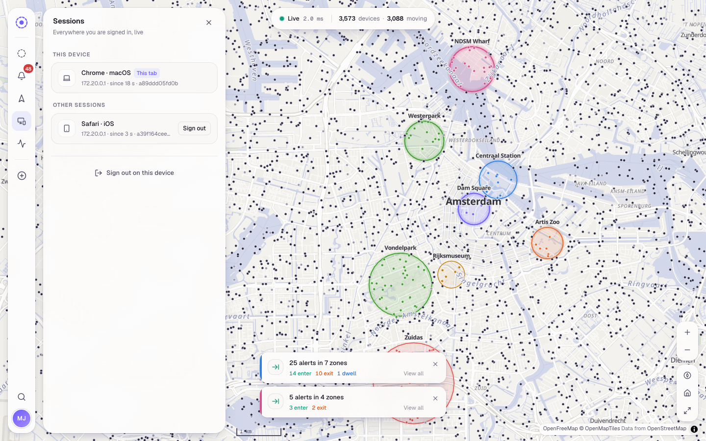

# Perimeter

Live tracking and geofence alerts for large device fleets, built on FastAPI, PostGIS and NATS
JetStream.

Devices report their positions over HTTP or a WebSocket. Every browser session watches the fleet
move in real time and is alerted the moment a device enters, leaves or lingers in one of that
user's circular geofences — on every tab and device the user has open, with nothing lost when a
connection drops, a replica restarts or a process is killed.


**[Run it](#run-it) · [See it work](#see-it-work) · [The brief, point by point](#the-brief-point-by-point) ·
[How it works](#how-it-works) · [Design decisions](#design-decisions) · [Measured](#measured) ·
[API](#api) · [Tests](#tests) · [Limits](#limits-and-next-steps)**

## Run it

Docker is all it takes: Docker Engine 26 or newer (secrets are mounted from volume subpaths) and
Docker Compose 2.24 or newer, with at least 2 CPUs and 3 GB of memory for Docker. The stack is
verified with Engine 28.4 and Compose 5.0. Python, Node, PostgreSQL and NATS all build inside it.

```bash
make up                  # = docker compose up -d --build --wait
open http://localhost:8080
```

The first build takes ⟪BUILD⟫ (images and dependencies download once); later starts take about
20 s. The first start generates every credential into a Docker volume, so there is nothing to
configure; `.env.example` documents the optional knobs.

| | |
|---|---|
| Dashboard | <http://localhost:8080> — sign in with any username |
| Interactive API reference | <http://localhost:8080/docs> |
| Drive 10,000 devices | `make load` |
| End-to-end check of the running stack | `make smoke` |
| Kill a replica under load and audit the result | `make drill` (`KILL=api` for an API replica; needs `python3`) |
| Traces and metrics | `make observe` → Jaeger on :16686, Prometheus on :9090 |
| Stop / delete everything | `make down` / `make destroy` |

Every target is a short `docker compose` command (`make -n <target>` prints it), so nothing needs
`make`. Only development needs more: the Python tests and linters run with
[uv](https://docs.astral.sh/uv/), the web ones with Node 22.12 or newer.

## See it work

1. Open <http://localhost:8080> and sign in as `demo`.
2. Start the fleet with twenty demo zones owned by `demo`:

   ```bash
   make load ARGS="--observe demo --zones 20 --keep-zones"
   ```

   10,000 devices start moving over Amsterdam; the zones appear on the map, alerts stream into
   the timeline and the notifications, and each zone pulses with the devices reporting inside it.
   The run lasts five minutes (`--duration 0` runs until Ctrl-C).
3. Draw a zone of your own (press **D**, or pick "New zone at map centre" in the command palette
   with ⌘K), then open the dashboard in a second browser as `demo`: both sessions receive every
   alert and every zone change, and the Sessions panel lists them. The Pipeline panel shows
   throughput, backlog and event-loop lag of every process as they happen.

<p>


</p>

## The brief, point by point

| The brief asks for | Where | Notes |
|---|---|---|
| FastAPI, PostgreSQL + PostGIS, SQLAlchemy (async), Docker & Compose | `perimeter/api`, `perimeter/storage`, `docker-compose.yml` | Python 3.14, FastAPI, SQLAlchemy 2 async on asyncpg (set-based Core statements; ORM models describe the schema), Alembic, GeoAlchemy2, PostgreSQL 18 + PostGIS 3.6 |
| Ingestion endpoint (HTTP/WS) with `device_id`, `latitude`, `longitude`, `timestamp` | `POST /v1/telemetry`, `WS /v1/telemetry/stream` | The brief's field names; one report, an array or `{"reports": [...]}`; JSON or MessagePack. The timestamp is required: with the device id it makes a retry idempotent |
| Geozone CRUD: circles (centre, radius in metres), isolated per user | `/v1/geozones` | `center: {lat, lon}`, `radius_m` (10 m – 100 km); another user's zone answers `404`, never `403` |
| Live map over a WebSocket, alerts when a device is within the user's active zones | `WS /v1/live` | Positions stream for the viewport the client declares (binary tile frames); alerts arrive as events |
| "Notify whenever a device enters or reports a location within" a zone | [§4](#4-alerts-exactly-the-transitions) | Every in-zone report is pushed live as a zone *pulse*; durable alerts are the transitions (enter, exit, dwell), so a parked device does not page its owner every 3 s |
| Several sessions per user | [§6](#6-websocket-state-management-many-sessions-per-user) | Every session of a user, on any replica, receives every event exactly once |
| Mocked authentication | `POST /v1/session`, `POST /v1/token` | A username signs in (the account is created on first use) |
| `generator.py`: async, 10,000 devices, drifting coordinates | [`generator.py`](generator.py) | asyncio + aiohttp; realistic trips; open loop; measures device-to-browser latency |
| README: build and run, the generator, architecture | this file | Spatial queries §1, WebSocket state management §5–6, high throughput §2–3 and [Measured](#measured) |

What the brief grades, and where to look: **connection pooling** §7 · **backpressure** §2 ·
**non-blocking event loop** §8 · **geography vs geometry, `ST_DWithin`** §1 · **WebSocket
architecture** §5–6 · **async correctness** §3, §8 · **tests for the spatial logic** [Tests](#tests)
· **clean, secure Docker setup** §9.

The brief leaves the messaging layer open. NATS JetStream does four jobs in one component: a
durable, replayable, partitioned log for reports (ordered per device), per-user event streams with
gap-free resume, a key-value store with compare-and-set for engine leases and the session registry,
and subject-based fan-out of positions to exactly the replicas whose clients look at them.

## How it works

```mermaid
flowchart LR
    devices([devices]) -- "HTTP batch / WS + credit" --> edge
    browsers([browsers]) -- "dashboard, REST, /v1/live" --> edge
    edge[edge · Caddy] --> api1[api] & api2[api]
    api1 & api2 -- "publish, acked" --> tlm[("TELEMETRY<br/>16 partitions by device")]
    tlm -- "one leased owner per partition" --> eng1[engine] & eng2[engine]
    eng1 & eng2 -- "1 fenced transaction per batch" --> pg[("PostgreSQL 18<br/>PostGIS 3.6")]
    eng1 & eng2 -- "alerts: outbox → EVENTS" --> evt[("EVENTS<br/>a sequence chain per user")]
    api1 & api2 -. "zone changes: outbox → EVENTS" .-> evt
    eng1 & eng2 -- "binary tile frames" --> pos{{"pos.‹quadkey›"}}
    evt -- "live.evt.‹user›" --> api1 & api2
    pos -- "only viewed tiles" --> api1 & api2
```



**The life of one location report**

1. A device posts a batch to the **edge** (Caddy), which balances over the API replicas.
2. An **API replica** checks the device token and admission control *before reading the body*,
   decodes and validates every report in C (msgspec), and publishes each one to JetStream with a
   de-duplication id. It answers `202` only after JetStream has stored all of them: an
   acknowledged report is durable.
3. The **TELEMETRY** stream partitions reports by device (a `partition(16)` subject mapping in the
   broker), so one device's reports always land in the same partition, in order.
4. The **engine** replica that holds the partition's lease fetches a batch and applies it in one
   transaction: claim the partition with its fencing token, ask PostGIS which active zones contain
   each report (one indexed statement for the whole batch), run the enter/exit/dwell state machine,
   write positions, the device tracks, presence, alerts and their outbox events. Commit, then
   acknowledge.
5. Positions go out as binary frames on `pos.<quadkey>` subjects, one per map tile. Alert events
   leave the outbox for the **EVENTS** stream, which republishes each to `live.evt.<user>` with its
   sequence and the user's previous one.
6. Every API replica with a viewer on that tile relays the position frame; every replica serving a
   session of that user relays the event to each of the user's sockets. The browser draws both.

| Component | Role |
|---|---|
| `edge` | Caddy: the dashboard and the API reference, a reverse proxy to the API replicas (DNS discovery), strict security headers. The only published port. |
| `api` ×2 | FastAPI + uvicorn: REST, device ingestion (HTTP and WebSocket), the live channel. Stateless apart from its open sockets. |
| `engine` ×2 | The geofence processor: partition ownership, batch transactions, outbox relay, tile frames. |
| `nats` | JetStream: `TELEMETRY` (device reports, partitioned), `EVENTS` (per-user events), KV buckets for engine leases, live sessions and revoked tokens. |
| `db` | PostgreSQL 18 with PostGIS 3.6: users, zones, latest positions, device tracks (time-partitioned), presence, alerts, outbox. |
| `secrets`, `init` | One-shot jobs: generate credentials on first start; run migrations and provision the broker. |

## Design decisions

Deeper reasoning, and the bugs that shaped it, are in [docs/design.md](docs/design.md).

### 1. Spatial queries: `geography` for truth, a planar envelope for speed

Zone centres and device positions are `geography(Point, 4326)`: distances in metres on the WGS84
spheroid, anywhere on Earth, with no projection to choose. Whether a device is inside a zone is
always decided by PostGIS, with `ST_DWithin(zone.center, point, zone.radius_m)`; nothing measures
distance in Python.

With a radius per zone, that test alone cannot use an index. Each zone therefore also stores a
lon/lat **envelope** — a box provably large enough to contain the circle, computed by a SQL
function in a generated column and indexed with GiST — and the engine's batch statement filters by
the box before deciding with the exact predicate:

```sql
JOIN geozones z
  ON z.is_active
 AND z.envelope && ST_SetSRID(ST_MakePoint(r.lon, r.lat), 4326)          -- GiST, planar, cheap
 AND ST_DWithin(z.center, ST_SetSRID(ST_MakePoint(r.lon, r.lat), 4326)::geography, z.radius_m)
```

Against 10,000 zones, 1,000 reports take 80 ms this way and 7.1 s as a naive join, with identical
results. Viewport questions ("which devices are on screen") are lon/lat rectangles and run as planar
tests on an index over `position::geometry`: a `geography` rectangle has great-circle edges and
missed devices near its equatorward edge, which a property test found.

### 2. Ingestion and backpressure

- **Acknowledged means stored.** `POST /v1/telemetry` validates each report on its own and answers
  `202 {"accepted": n, "duplicates": d, "rejected": [{index, code, detail}]}` only after JetStream
  has stored every accepted report. A retried report (same device and timestamp) is stored once and
  counted in `duplicates`.
- **Admission control** watches the engines' backlog. Above `INGEST_ADMISSION_HIGH` reports every
  replica sheds ingest with `503` and a `Retry-After` computed from the measured drain rate, before
  reading the body; it resumes below `INGEST_ADMISSION_LOW`. A backlog it cannot measure counts as
  too high. Shedding ingest leaves everything else served: the edge takes a replica out of rotation
  only when it cannot reach it.
- **An in-flight budget** (`INGEST_MAX_INFLIGHT`) bounds the reports a replica holds while waiting
  for acknowledgements: `429` rather than unbounded memory.
- **WebSocket ingestion** (`/v1/telemetry/stream`) uses credit: the server grants a window of
  reports, returns credit as they are stored and withholds it while shedding, so a device pauses
  instead of being dropped or disconnected.

### 3. One owner per partition, and a fence for the one that has not noticed

- Each engine takes partitions through **leases** in a KV bucket (compare-and-set, renewed by
  revision; assignment by rendezvous hashing, so a joining or leaving engine moves only its share).
- **Fencing:** every batch transaction starts with
  `INSERT INTO partition_epochs … ON CONFLICT (partition) DO UPDATE … WHERE (generation, revision) <= (new token)`.
  An engine that paused past its lease matches nothing there, and its transaction rolls back
  before writing anything.
- **Takeover recovery:** a new owner first applies what the dead one had fetched but not
  acknowledged, straight from the stream, so late redeliveries cannot lose transitions. Killing an
  engine under load found this (222 of 2,700 alerts missing); the drill now loses nothing.
- **Batching grows with load:** a drained partition waits `ENGINE_LINGER_MS` before its next fetch,
  so one transaction carries many reports; under a backlog every batch is full.

### 4. Alerts: exactly the transitions

A pure, separately tested state machine turns PostGIS's answers into transitions per device and
zone: **enter** when a device reports from inside a zone it was not in (including the first report
after a zone is created around it), **exit** when it reports from outside a zone it was in,
**dwell** once per stay after `dwell_s` seconds inside. Reports are applied in event-time order, so
a device that enters and leaves within one batch still yields both. A report not newer than the
device's last one is kept in its track but changes nothing, so redelivery is harmless.
Deactivating a zone clears its presence silently; editing its geometry lets the next report decide.

The brief also asks to notify "whenever a device enters or reports a location within" a zone.
Every in-zone report is pushed to the zone owner's sessions as a live **pulse**; durable alerts are
reserved for transitions, so a device parked inside a zone does not page its owner every 3 s.

### 5. WebSocket architecture: encode once, filter at the broker, never wait on a socket

- **Positions are binary.** A tile frame holds ids and fixed-point columns: 26 bytes per device,
  against 100–120 as compact JSON with the same fields. The engine encodes it once; API replicas
  forward the bytes to every interested socket without decoding them, and browsers read the columns
  straight into WebGL buffers.
- **The broker does the filtering.** Frames are published per map tile on `pos.<d1>.<d2>…<d12>`,
  one quadkey digit per subject token. A replica subscribes to the smallest set of prefixes covering
  its clients' viewports (`pos.1.2.0.>` for a wide view, twelve digits for a street), so it receives
  only what someone it serves is looking at.
- **Producers never await a socket.** Each connection has a reader task, a writer task and two
  bounded lanes: events (by count) and positions (by bytes). A client that falls behind on
  positions has them dropped and gets a `resync` (positions are state; the next snapshot is newer);
  one that falls behind on events is closed with 4008 and resumes by sequence. A stalled client
  costs its own lanes, nobody else's latency.
- **Snapshots** of a newly viewed area come from PostGIS, cached per tile for a second and shared
  by concurrent requests, so a room of reconnecting dashboards runs one query.

### 6. WebSocket state management: many sessions per user

- **Per replica:** the hub keeps each open socket's session (its viewport's tile prefixes, its lanes,
  its resume position), one feed per user it serves (a single broker subscription carries that
  user's events, pulses and session notices), and an interest trie of the tiles its clients view.
  Nothing else is held in memory: a replica that dies loses only its sockets, and they reconnect
  to the other.
- **Cluster-wide:** a KV bucket lists every live session of a user on every replica (the Sessions
  panel); signing one out revokes its token everywhere and closes its socket with 4001. A socket
  also closes, with 4002, when its token expires.
- **Durable events:** alerts and zone changes are written to a transactional outbox with the
  change, relayed to the `EVENTS` stream (right after the commit, plus a sweeper for crashes in
  between) and de-duplicated by id. Each user's events form one sequence chain: every event carries
  the user's previous sequence, so a replica notices a gap and fills it from the stream before
  delivering anything else.
- **Resume:** a browser remembers the last sequence it received; after a reconnect, to any replica,
  it sends `resume_after` and gets exactly the events it missed, then continues live.

### 7. Connection pools that fail fast instead of piling up

Pools are bounded with no overflow and a short checkout timeout (`DATABASE_POOL_TIMEOUT_S`, 2 s):
exhaustion becomes a `503 database_unavailable` with `Retry-After` within that time, never a queue
of coroutines holding requests open. Statement and idle-in-transaction timeouts on the server back
that up. Request handlers and batch transactions release their connection before any broker I/O.
The budget is explicit: 2 API × 10 + 2 engines × 18 (a connection per partition an engine may own,
plus two) + init = 58 of `max_connections = 80`. Snapshot queries may use at most a quarter of the
API pool.

### 8. The event loop stays free

Validation and serialisation run in C (msgspec, pydantic-core), distance maths in PostGIS, binary
frames are packed with `array`/`struct`, and queues, waits and sends are bounded. Each process
measures its own event-loop lag and exports it (`perimeter_event_loop_lag_seconds`, and the
dashboard's Pipeline panel), so "nothing blocks the loop" is measured: ⟪LOOPLAG⟫ at the brief's
load.

### 9. Secure by default

- **No secrets in the environment, the compose file or git.** A one-shot job generates every
  credential into a volume on first start; each service mounts only its own directory of it and
  reads `*_FILE` settings. PostgreSQL gets SCRAM verifiers, NATS bcrypt hashes.
- **Least privilege.** Separate database roles (the schema owner for migrations, a row-only role
  for the services). Per-service broker users with subject allow-lists: no service can delete or
  purge a stream, and the API cannot touch the engine's consumers (`make audit-broker` checks the
  broker's log for any refusal).
- **Containers** run as non-root users with read-only root file systems, no capabilities,
  `no-new-privileges`, resource limits and `internal` networks for the database and broker; only
  the edge publishes a port, on 127.0.0.1 by default. Base images are pinned by digest, with
  Dependabot proposing updates.
- **HTTP**: a strict Content-Security-Policy (the API reference page is served by the edge itself,
  scripts from its own origin only), `nosniff`, `frame-ancestors 'none'`, `Referrer-Policy`,
  `Permissions-Policy`.
- **Sessions**: a browser's token lives only in an HttpOnly, SameSite cookie and never in a
  response body; scripts get bearer tokens from `POST /v1/token`. Tokens are never accepted in
  URLs. A socket authenticated by the cookie must come from an allowed `Origin` (no cross-site
  WebSocket hijacking). Sign-in and zone changes are rate-limited, and an account keeps at most
  `ZONE_MAX_PER_USER` zones.

### 10. Observable end to end

`make observe` adds Prometheus and Jaeger. One trace follows an alert from the device's report
through the engine batch and its SQL to the API replicas that deliver it; every process exports
its throughput, latencies, backlog and loop lag.


## Measured

Measured on a laptop (Apple M5 Pro; Docker in an 8-vCPU VM) with the stack exactly as shipped,
load going through the edge like real devices. Methods, commands and full tables:
[docs/benchmarks.md](docs/benchmarks.md).

⟪MEASURED⟫

## API

The full reference is at <http://localhost:8080/docs> (Authorize with a token from `POST /v1/token`,
or the device token from `make ingest-token`). Errors are RFC 9457 problem details
(`application/problem+json`) with a stable `code`.

| Method | Path | |
|---|---|---|
| `POST` | `/v1/session` | Browser sign-in with a username (the account is created on first use): sets the session cookie |
| `POST` | `/v1/token` | The same for scripts: returns a bearer token, sets no cookie |
| `DELETE` | `/v1/session` | Sign out (the token is revoked on every replica) |
| `GET` | `/v1/me` | The signed-in user |
| `GET` `POST` | `/v1/geozones` | Your zones (keyset pages, with live occupancy) · create a zone |
| `GET` `PATCH` `DELETE` | `/v1/geozones/{id}` | One zone; `ETag`/`If-Match` for safe concurrent edits |
| `GET` | `/v1/geozones/{id}/occupants` | Devices inside the zone now |
| `GET` | `/v1/alerts` | Alert history: filter by zone, kind, device, time; keyset pages |
| `GET` | `/v1/devices?bbox=w,s,e,n` | Latest positions in a viewport (GeoJSON) |
| `GET` | `/v1/devices/{id}` · `/trail` | Latest state and the zones it is in · recent track (kept 30 minutes) |
| `GET` `DELETE` | `/v1/sessions` · `/{sid}` | Live sessions of this user on every replica · remote sign-out |
| `POST` | `/v1/telemetry` | Device ingest (device token) |
| `WS` | `/v1/telemetry/stream` | Device ingest with credit flow control |
| `WS` | `/v1/live` | The dashboard's live channel |

```bash
TOKEN=$(curl -s -X POST localhost:8080/v1/token -H 'content-type: application/json' \
          -d '{"username": "ada"}' | python3 -c 'import json,sys; print(json.load(sys.stdin)["token"])')
curl -s -X POST localhost:8080/v1/geozones -H "authorization: Bearer $TOKEN" \
     -H 'content-type: application/json' \
     -d '{"name": "Dam Square", "center": {"lat": 52.3731, "lon": 4.8926}, "radius_m": 250}'
make ingest-token          # copies the device token to .secrets/ingest_token
curl -s -X POST localhost:8080/v1/telemetry \
     -H "authorization: Bearer $(cat .secrets/ingest_token)" -H 'content-type: application/json' \
     -d "{\"device_id\": \"truck-7\", \"latitude\": 52.3733, \"longitude\": 4.8921,
          \"timestamp\": \"$(date -u +%Y-%m-%dT%H:%M:%SZ)\"}"
curl -s "localhost:8080/v1/alerts?limit=5" -H "authorization: Bearer $TOKEN"   # the enter alert
```

**Live channel** (`/v1/live`, cookie or bearer header). Server to client: `hello` first (session,
resume mode, tile zoom), then binary position bundles for the declared viewport, `event` frames
`{seq, prev, event}` (alerts and zone changes), `pulse`, `sessions`, `resync`, `ops`, `pong`.
Client to server: `viewport` (bounding box and zoom — positions flow once one is sent), `resume`
(or `?resume_after=` on connect), `ping`, `ops`. Close codes: 4001 signed out, 4002 session
expired, 4003 forbidden, 4008 fell behind (resume), 4009 too many sessions, 1001/1011/1012/1013
reconnect.

## Load generator

`generator.py` is the simulator the brief asks for: an asyncio script that moves 10,000 devices
at once and reports each position every few seconds.

```bash
make load                                  # 10,000 devices, every 3 s, 5 minutes, inside the network
make load ARGS="--devices 30000 --interval 1 --transport ws"
make ingest-token                          # or from the host: copy the device token once, then
uv run generator.py --token-file .secrets/ingest_token --observe demo --zones 20
```

Without uv, `pip install aiohttp` and `python3 generator.py …` works the same (Python 3.11+).

- **Realistic movement.** Random-waypoint trips with turn-rate-limited curves and pauses;
  vehicles, cyclists and pedestrians at their own speeds; 5 % of devices never move; Gaussian GPS
  noise; longitude steps scaled by latitude. `--seed` replays the same fleet and trips.
- **Open loop.** Every device reports on its own schedule whatever the server does, so an
  overloaded server shows up as throttling and dropped reports instead of a politely lowered load.
  One clock task and a heap schedule the fleet — no task per device.
- **Batching like a gateway.** Reports of many devices share requests (up to 250 per request over
  32 connections) or WebSocket frames (`--transport ws`, with credit flow control); `--batch 1`
  sends one request per report. `503`/`429` `Retry-After` pause only the connection that got them.
- **Observe mode.** `--observe NAME` signs in, creates demo zones (`--zones`, kept with
  `--keep-zones`), opens the live channel and measures device-to-browser latency of positions and
  alerts.
- **A summary that balances.** Every report ends accepted, rejected (by code) or dropped (by
  reason), and `--json FILE` (or `-` for standard output) writes the summary for scripts.

## Tests

```bash
make test          # everything; integration tests start PostGIS and NATS in containers
make test-unit     # no Docker needed
make lint typecheck
cd web && npm ci && npm test
```

⟪TESTS⟫ `mypy --strict` and Ruff are clean. Integration tests run against real PostgreSQL + PostGIS
and NATS started by testcontainers (or services named by `TEST_DATABASE_URL` / `TEST_NATS_URL`).
Highlights, detailed in [docs/design.md](docs/design.md#6-tests-worth-knowing-about):

- **Spatial correctness**: Hypothesis with GeographicLib as the oracle, up to ±84° and across the
  antimeridian, and every circle, polar ones included, inside its envelope; indexed matching equal
  to the naive join; `EXPLAIN` asserts the index plans.
- **The state machine**: any split of a track into batches gives the same alerts; replays are
  no-ops; enter and exit alternate; dwell fires once per stay.
- **Failure paths on real infrastructure**: fencing, takeover, a recreated lease bucket, track
  maintenance under a backup's locks, zones deleted and deactivated mid-batch, pool exhaustion.
- **The live channel with two real API servers** sharing one broker, and **the broker's permission
  matrix** on a secured server.

CI (`.github/workflows/ci.yml`) runs lint, types and the full suite with a coverage floor of 90 %,
the web gates, and a stack job that builds the images, starts the stack, runs `make smoke`, kills
an engine under load (`make drill`: nothing may be lost or doubled) and checks the broker's log
for refusals.

## Limits and next steps

- **One PostgreSQL, one NATS server.** Streams and buckets have one replica, so a crashed broker or
  database stops the pipeline until it restarts (durable state survives). A three-node NATS cluster
  (R3 streams) and a PostgreSQL replica change configuration, not code.
- **PostgreSQL bounds throughput here** (⟪CEILING⟫ reports/s on this laptop, tracks included). Next
  steps would be `COPY` for the track inserts and a separate store for position history
  (TimescaleDB or a columnar store), keeping the transactional state small.
- **Positions are fleet-wide**, as in the brief: every user sees every device, while zones and
  alerts are per user. Tenant-scoped fleets would add a tenant token to the position subjects.
- **One device token** authenticates every device; per-device credentials (or mTLS at the edge) would
  let a single device be revoked.
- **Mocked sign-in** (a username, no password), as the brief allows: anyone can create accounts,
  so per-account limits bound each one but not their number. The rest of the system only sees the
  signed token's claims, so an OIDC provider replaces one module.
- **Failover pause:** a crashed engine's partitions wait for its leases to expire (6 s) plus one
  round; a shorter `ENGINE_LEASE_TTL_S` trades broker writes for faster takeover.
- **Alerts are report-driven:** a device that goes silent inside a zone stays inside it until it
  reports again; a staleness timeout could close such stays.
- **Plain HTTP on localhost.** Caddy can terminate TLS by itself for a real hostname; set
  `SECURE_COOKIES=true` behind TLS.
