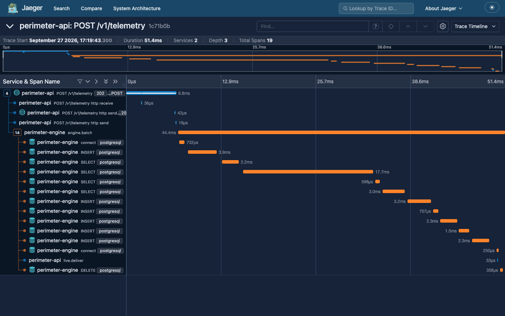

# Design notes

The README says what each part does and why; this document is for the reader who wants the
reasoning behind the less obvious parts, and the bugs that shaped them.

## 1. The zone envelope: an index for a per-row radius

Every zone has its own radius, so the natural containment test,

```sql
ST_DWithin(z.center, point::geography, z.radius_m)
```

takes its search distance from the table being searched and no index can serve it: PostgreSQL
would evaluate it for every active zone of every report. Each zone therefore also stores a
**conservative lon/lat box** (`envelope`, a generated column computed by the SQL function
`perimeter_envelope`, with a partial GiST index over active zones). The engine's batch statement
filters with the box first and decides with the exact geodesic test:

```sql
JOIN geozones z
  ON z.is_active
 AND z.envelope && ST_SetSRID(ST_MakePoint(r.lon, r.lat), 4326)          -- GiST, planar, cheap
 AND ST_DWithin(z.center, ST_SetSRID(ST_MakePoint(r.lon, r.lat), 4326)::geography, z.radius_m)
```

**Why the box is always large enough.** A degree of latitude is shortest at the equator, where
it measures `a(1 − e²)·π/180 ≈ 110 574 m` on the WGS84 ellipsoid, so a circle of radius `r` never
reaches more than `r / 110 574` degrees north or south of its centre. Within that latitude band, a
parallel's radius is at least `a·cos φ*`, where `φ*` is the band's latitude furthest from the
equator, which bounds the longitude span the same way. Both bounds get a margin of 1e-9°. Near a
pole the band reaches ±90° and the box spans every longitude; a circle that crosses the
antimeridian gets two boxes. The box may be larger than the circle — the exact test decides — but
never smaller, so the filter never drops a real match.

| 1,000 reports against | naive `ST_DWithin` join | envelope + `ST_DWithin` |
|---|---|---|
| 100 zones | 108 ms | 4.2 ms |
| 1,000 zones | 724 ms | 14.3 ms |
| 10,000 zones | 7,097 ms (sequential scans) | 80 ms (index scans), identical results |

The tests that keep it honest: the SQL function and a Python mirror of it agree to 1e-9°; a
Hypothesis property places points just inside and just outside random circles up to ±84° and
across the antimeridian, computed with GeographicLib (Karney's geodesics, independent of PostGIS),
and checks that PostGIS decides every one correctly; a second property checks that every circle,
polar ones included, lies inside its envelope; the batch query is compared with the naive join on
400 zones × 1,000 points; and `EXPLAIN` must show the envelope index.

**Viewports are planar on purpose.** "Which devices are in this map view" is a lon/lat
rectangle. As a `geography` box its edges would be great circles, which bow towards the pole and
miss points near the equatorward edge of a wide view — a Hypothesis property found exactly that.
It runs as a planar test on a GiST index over `position::geometry`, decided exactly with
`BETWEEN` (index boxes are float4-rounded outwards), and split in two across the antimeridian.

## 2. One owner per partition, and a fence for the one that has not noticed

Reports of one device must be applied in order, so the telemetry stream is split into 16
partitions by device (a subject transform in the broker, `partition(16)`), and exactly one engine
consumes each partition at a time.

- **Leases** live in a KV bucket: created with compare-and-set, renewed by revision every third of
  their TTL, deleted early on a clean shutdown, and left to expire when an engine dies.
- **Assignment** uses rendezvous hashing over the live engines, so each engine computes the same
  answer and a joining or leaving engine moves only its own share.
- **Fencing.** A paused engine (a long GC pause, a frozen VM) can wake up after its lease expired
  and another engine took the partition. Every batch transaction therefore starts by claiming the
  partition in `partition_epochs` with the lease's token:

  ```sql
  INSERT INTO partition_epochs AS e (partition, generation, revision, owner, updated_at)
  VALUES (...)
  ON CONFLICT (partition) DO UPDATE SET ...
   WHERE (e.generation, e.revision) <= (EXCLUDED.generation, EXCLUDED.revision)
  ```

  A stale owner's upsert updates nothing and the transaction rolls back before it writes anything.
  The token is the pair (bucket generation, key revision): revisions grow with every write to the
  bucket, and the generation — the bucket's creation second, read afresh for every acquisition —
  grows if the broker lost its store and the bucket was created again (its revisions start from 1
  then). Compared as a row, neither half can overflow.
- **A fetch never outlives the lease.** Each pull request expires while the lease is still known to
  be valid, so a stale owner cannot receive messages after a new owner took the partition over.

**Takeover recovery.** Messages a dead owner had fetched but not acknowledged come back from the
broker only after the ack timeout (30 s) — long after the new owner has applied newer reports of
the same devices, so they would arrive as late reports and their transitions would be lost. The
first failure drill found this: killing an engine under load lost 222 of 2,700 alerts. A new owner
now reads the unacknowledged range straight from the stream and applies it before its first fetch;
a test that fails without the fix pins it, and the drill loses nothing.

## 3. Delivery: from a committed transaction to every socket

- **Transactional outbox.** Alerts and zone changes are written as events in the same transaction
  as the change. Right after the commit, the process that wrote them publishes them to the `EVENTS`
  stream and deletes the rows (the fast path); a sweeper claims rows older than two seconds
  (reserving them with a short `UPDATE … SET claimed_until`, so nothing is held open while the
  broker answers) and covers crashes and hiccups in between. Each event carries its id as
  `Nats-Msg-Id`, so a republish within the stream's five-minute window is dropped; the dashboard
  also ignores an alert id it has already shown, for the rare republish after a longer outage.
- **One sequence chain per user.** Each user has one subject in `EVENTS`, and the broker
  republishes every stored event to `live.evt.<user>` with its sequence and the previous sequence of
  the same subject. An API replica serving any session of that user subscribes once, remembers the
  last sequence it delivered and, when an event's "previous" is not that, reads the gap back from
  the stream (JetStream direct get) before delivering anything else.
- **Resume.** A browser keeps the last sequence it received; after a reconnect, to any replica, it
  sends `resume_after` and gets exactly the events it missed, then continues live.
- **Tracing.** The trace context travels in the standard `traceparent` header from the ingest
  request into the engine batch that applies the report, from that transaction into the events it
  writes, and from those to the API replicas that deliver them — one trace per alert, from the
  device's report to the sockets that show it:

  

## 4. Load shedding, end to end

- **Admission control** samples the engine consumers' backlog every 500 ms. Above the high
  watermark every API replica answers ingest with `503` and a `Retry-After` computed from the
  measured drain rate — before reading the body — and resumes below the low watermark. A backlog it
  cannot measure counts as too high.
- **The in-flight budget** bounds the reports a replica holds while it waits for acknowledgements:
  a batch that cannot get budget within half a second gets `429`.
- **WebSocket ingestion** uses credit: the server grants a window of reports, returns credit as
  they are stored, and withholds it while shedding, so a device pauses instead of being dropped.
- **The edge** counts only failed connections against a replica. An API `503` is deliberate — load
  shedding, or a database momentarily unavailable — and taking a replica out of rotation for it
  would turn shedding into an outage of the whole API. With ingest forced to shed for a whole
  minute, `GET /v1/me` through the edge answered `200` on every one of 120 probes.

## 5. Bugs worth knowing about

Found by running the system rather than reading it:

1. **Killing an engine lost 222 of 2,700 alerts** — the takeover problem in §2.
2. **Alerts took 5–10 s instead of 80 ms.** A broker permission refused the API's per-user
   subscription, and the periodic audit that heals gaps hid the failure by delivering every event
   within its ten-second cycle. `make audit-broker` now fails on any refusal, and the permission
   test subscribes exactly the way the API does.
3. **Reading a device's trail could take the broker down.** Trails were read out of the telemetry
   stream, which made the broker walk its file blocks; under load it hit its memory limit. Tracks
   moved to time-partitioned PostGIS tables, and the broker's memory under the same load went from
   about 780 MB to 150–300 MB.
4. **Viewport queries missed devices** near the equatorward edge of wide views (a Hypothesis
   property): the planar viewports in §1.
5. **A lease that expired while it was being acquired raised an error** instead of being taken.
   The NATS client's create answers "taken" with a second round trip that reads the key back; when
   the holder's entry expires in between, that read finds nothing. A test that failed once in a full
   coverage run showed it; a test that holds that read until the entry expires reproduces it.

Found in code review:

6. **A publish that could not be sent kept a pending slot forever** in the NATS client's
   asynchronous JetStream publishing; after enough of them (an invalid subject, a closed
   connection, a full reconnect buffer) every publish would wait. Ingest and the outbox relay
   publish through a small `StreamPublisher` of their own that cleans up on every path, and a
   device id can no longer end in a newline (`$` in a Python pattern allows one; `\z` does not).
7. **The edge took shedding replicas out of rotation.** It counted any `503` as a failed replica, so
   ingest shedding would soon have taken every replica out, and sign-in and every REST call with
   them (§4).
8. **Track maintenance could stop for good.** PostgreSQL refuses to create a partition while the
   default partition holds rows of its range, and maintenance that could not run for 20 minutes
   (a long backup holding locks) left exactly that. Slots are now built apart, filled with those
   rows and attached; each step gives up after half a second instead of queueing inserts behind it.
9. **Deactivating a zone could race a batch that had just read it as active**, leaving presence
   behind: deactivation and deletion now take a lock that waits for such batches.
10. **A socket closed while its client was still talking** could set up subscriptions again during
    the teardown: messages of a session being torn down are ignored.
11. **A retried report without a timestamp was stored twice** under two receive times, and could
    move a device back: the timestamp is now required, as in the brief, and the ingest answer says
    how many reports were duplicates.

## 6. Tests worth knowing about

- **Spatial correctness** (§1): GeographicLib as the oracle, the naive join as the reference,
  `EXPLAIN` for the index plans.
- **The state machine** is pure, and Hypothesis checks its invariants over random tracks: any
  split of a track into batches yields the same alerts; enter and exit alternate per zone;
  replaying applied reports is a no-op; dwell fires at most once per stay.
- **Failure paths on real infrastructure** (PostGIS and NATS in containers): fencing rejects a
  stale owner; two engines split and hand over partitions; a crashed owner's unacknowledged
  messages are replayed first; a recreated lease bucket still yields newer tokens; track
  maintenance catches up after falling behind and gives way to a backup's locks; zones are
  deleted and deactivated mid-batch.
- **The live channel with two real API servers** sharing one broker: one user's sessions on both
  receive each event once; a resume after a disconnect replays exactly the gap; gaps heal; slow
  consumers are cut off without slowing anyone else; remote sign-out, token expiry and origin
  rules close the right sockets.
- **The broker's permission matrix** on a secured server: each service's real work passes, and
  every forbidden action is refused and logged.
- **The load generator** against scripted fake servers: throttling, shedding, retries, reconnects
  and resume, with books that balance to the report.
